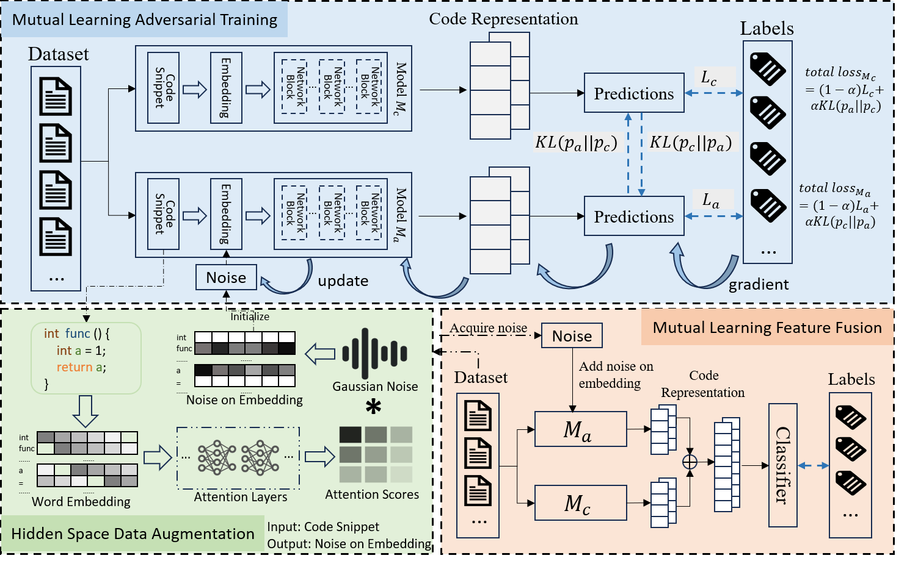

# MARVEL

The repo of ASE 2024 submission "Mutual Learning-Based Framework for Enhancing Robustness of Code Models via Adversarial Training", which contains the codes of our framework on all tasks and models.

---

## Overview



### Build `tree-sitter`

We use `tree-sitter` to parse code snippets and extract variable names. You need to go to `./language_parser/parser_folder` and build tree-sitter using the following commands:

```shell
bash build.sh
```

### Folder Structure

The folder structure is as follows.

```
.
├─language_parser
│  └─parser_folder
├─marvel
│  ├─authorshipAttribution
│  │  ├─code
│  │  ├─dataset
│  │  └─script
│  ├─defectPrediction
│  │  ├─code
│  │  ├─dataset
│  │  └─script
│  ├─Java250
│  │  ├─code
│  │  ├─dataset
│  │  └─script
│  ├─Python800
│  │  ├─code
│  │  ├─dataset
│  │  └─script
│  └─vulnerabilityDetection
│      ├─code
│      ├─dataset
│      └─script
└─utils
```

Under each subject's folder in `marvel/` (`authorshipAttribution/`, `defectPrediction/`, `Java250/`, `Python800/` and  `vulnerabilityDetection`), there are three folders (`code/`, `dataset/` and `script/`) and one `README.md` file. The original dataset and some data processing programs (for generating substitutions of attack algorithms) are stored in the `dataset/` directory. The `code/` directory contains our MARVEL codes, and attack codes (provided by [ALERT](https://github.com/soarsmu/attack-pretrain-models-of-code/tree/main) and [CODA](https://github.com/tianzhaotju/CODA/tree/main)), the `script/` directory contains commands for training and attacking.

## Experiments

We applied MARVEL to three code models on five datasets and evaluated them using three attack algorithms. You can perform experiments on the corresponding downstream task in the `./marvel`.

We can refer to the ` README.md` files under each folder to train models on different tasks. Let's take the  `CodeBERT `model, `Authorship Attribution `task and the `ALERT `attack algorithm as examples. First, you need to go to `./marvel/authorshipAttribution`:

```
cd ./marvel/authorshipAttribution
```

Then make sure the dataset is already in the dataset folder, then go to `./code` , run python  `run_mutual.py` to execute the MARVEL framework as follows:

```shell
cd ./code
CUDA_VISIBLE_DEVICES=0 python run_mutual.py \
    --do_train \
    --do_test \
    --epochs=30 \
    --model_type codebert \
    --save_name marvel \
    --train_batch_size=8 \
    --eval_batch_size=8 \
    --alpha=0.3 \
    --max_adv_step=3
```

The trained model is then saved in the `./model/codebert` folder, then execute ALERT attack to attack the MARVEL-enhanced model:

```shell
CUDA_VISIBLE_DEVICES=0 python attack.py \
    --attack_name=alert \
    --model_type=codebert \
    --eval_batch_size=8 \
    --save_name=marvel
```

It should be noted that substitutions need to be generated based on the original paper setting of the corresponding attack algorithm before executing the corresponding attack algorithm (e.g., [ALERT](https://github.com/soarsmu/attack-pretrain-models-of-code/tree/main) and [CODA](https://github.com/tianzhaotju/CODA/tree/main)).
